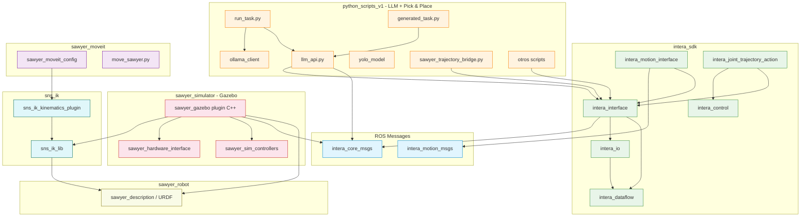

# Diagrama de Arquitectura

```mermaid
graph TD
    subgraph ROS_MSGS["ROS Messages"]
        CORE_MSGS[intera_core_msgs]
        MOT_MSGS[intera_motion_msgs]
    end

    subgraph SDK["intera_sdk"]
        INTERFACE[intera_interface]
        MOTION_IF[intera_motion_interface]
        JOINT_TRAJ[intera_joint_trajectory_action]
        IO[intera_io]
        DATAFLOW[intera_dataflow]
        CTRL[intera_control]
    end

    subgraph SCRIPTS["python_scripts_v1 - LLM + Pick & Place"]
        LLM_API[llm_api.py]
        RUN_TASK[run_task.py]
        GENERATED[generated_task.py]
        OLLAMA[ollama_client]
        YOLO[yolo_model]
        BRIDGE[sawyer_trajectory_bridge.py]
        SCRIPTS_EXTRA[otros scripts]
    end

    subgraph MOVEIT["sawyer_moveit"]
        MOVEIT_CFG[sawyer_moveit_config]
        MOVE_SAWYER[move_sawyer.py]
    end

    subgraph SIM["sawyer_simulator - Gazebo"]
        GAZ_PLUGIN[sawyer_gazebo plugin C++]
        SIM_CTRL[sawyer_sim_controllers]
        HW_IF[sawyer_hardware_interface]
    end

    subgraph SNS["sns_ik"]
        SNS_LIB[sns_ik_lib]
        SNS_PLUGIN[sns_ik_kinematics_plugin]
    end

    subgraph ROBOT["sawyer_robot"]
        URDF[sawyer_description / URDF]
    end

    INTERFACE --> CORE_MSGS
    MOTION_IF --> MOT_MSGS
    IO --> DATAFLOW
    INTERFACE --> IO
    INTERFACE --> DATAFLOW
    JOINT_TRAJ --> CTRL
    JOINT_TRAJ --> INTERFACE
    MOTION_IF --> INTERFACE

    LLM_API --> INTERFACE
    LLM_API --> CORE_MSGS
    RUN_TASK --> OLLAMA
    RUN_TASK --> LLM_API
    GENERATED --> LLM_API
    BRIDGE --> INTERFACE
    SCRIPTS_EXTRA --> INTERFACE

    GAZ_PLUGIN --> SNS_LIB
    GAZ_PLUGIN --> HW_IF
    GAZ_PLUGIN --> SIM_CTRL
    GAZ_PLUGIN --> CORE_MSGS
    SNS_PLUGIN --> SNS_LIB
    MOVEIT_CFG --> SNS_PLUGIN

    SNS_LIB --> URDF
    GAZ_PLUGIN --> URDF

    classDef ros fill:#e1f5fe,stroke:#0288d1
    classDef sdk fill:#e8f5e9,stroke:#388e3c
    classDef script fill:#fff3e0,stroke:#f57c00
    classDef moveit fill:#f3e5f5,stroke:#7b1fa2
    classDef sim fill:#fce4ec,stroke:#c62828
    classDef sns fill:#e0f7fa,stroke:#00695c
    classDef robot fill:#f9fbe7,stroke:#827717

    class CORE_MSGS,MOT_MSGS ros
    class INTERFACE,MOTION_IF,JOINT_TRAJ,IO,DATAFLOW,CTRL sdk
    class LLM_API,RUN_TASK,GENERATED,OLLAMA,YOLO,BRIDGE,SCRIPTS_EXTRA script
    class MOVEIT_CFG,MOVE_SAWYER moveit
    class GAZ_PLUGIN,SIM_CTRL,HW_IF sim
    class SNS_LIB,SNS_PLUGIN sns
    class URDF robot
```
